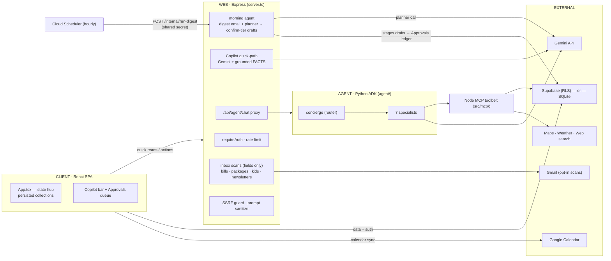

# Family-Hub — Architecture

A family hub — shared calendar, chores, shopping, and an AI **Copilot** — that runs two ways from one codebase:
a **cloud** deployment (Supabase + Cloud Run) or a **single-box LAN appliance** (Docker + local SQLite).

## The one-line shape

A React SPA backed by an Express server. The server is the **AI + integration proxy**: it runs the Copilot's
grounding + quick path against **Gemini**, and forwards agentic turns to a **Python multi-agent** service that
calls tools over an **MCP** toolbelt. Household data lives in **Supabase (Postgres + RLS)** in the cloud, or in a
local **SQLite** file on the appliance.

## Components

| Layer | Tech | Responsibility |
| --- | --- | --- |
| **Client** | React 19 + Vite + TypeScript | The whole UI + state hub (`src/App.tsx`), persisted collections, the Copilot bar, calendar/chores/shopping, the Approvals queue. |
| **Web server** | Express (`server.ts`) | Auth + rate-limit, the Copilot quick-path (Gemini + grounding), parse/geocode endpoints, the agent proxy, the **morning agent** (digest email + a planner pass that stages confirm-tier drafts), inbox scans (bills/packages/kids/newsletters — fields only), Google-OAuth token refresh, SSRF-guarded scraping. |
| **Agent service** | Python + Google ADK (`agent/`, FastAPI) | A root **concierge** engine routing to 7 tool-scoped specialists (calendar, chores, shopping, outings, briefing, bills, files). Runs on Gemini. |
| **Tool server** | Node MCP server (`src/mcp/`) | The agent's toolbelt over stdio: calendar/chores/shopping writes, goals, web research, booking hand-offs, doc management — each tier-gated. |
| **Storage** | Supabase Postgres **or** SQLite | Household data as JSON collections. Cloud: RLS-scoped `family_data`. Appliance: a local SQLite DB behind Express. |

> "Copilot" is the single user-facing assistant. "Concierge" is the internal codename for the ADK multi-agent
> engine — it never appears on screen.

## The Copilot: two engines, one bar

Every message from the Copilot bar is routed by `routeTurn` (`src/utils/copilotRouter.ts`):

- **Pure read-only questions** ("what's on the calendar?") → the **quick path**: one Gemini call in Express,
  grounded with pre-fetched FACTS (availability, places, weather). Cheap and fast; it can offer tap-to-add
  suggestion chips but doesn't autonomously call tools.
- **Everything actionable** (plan, book, add, move, delete) → the **agent**: the ADK concierge routes to a
  specialist that calls MCP tools. Reversible writes auto-apply; risky ones are **staged for approval**.

If the agent is unreachable the bar degrades to the quick path (clearly labeled), so it always answers.
By default both engines run on **Gemini** (`COPILOT_MODEL`); an optional local-model path (Ollama) exists for the
quick path only and is off unless explicitly enabled.

## Data & storage

Client state is a set of JSON **collections** (events, chores, shopping, goals, the Approvals ledger, …) synced
through `usePersistedCollection`.

- **Cloud mode:** collections persist to Supabase `family_data` (`household_id` + `data_key` → JSONB), gated by
  **Row-Level Security** so a user only ever sees their own household. Auth is Google OAuth via Supabase.
- **Appliance mode:** the same collections persist to a local **SQLite** file through Express; auth is a single
  **household passphrase** (scrypt-hashed) exchanged for a box-signed session token. No Supabase, no accounts.

The storage backend is chosen at runtime (`STORAGE` env), so **one build runs either mode**.

## Deploy modes

- **Cloud:** two Cloud Run services (web + agent) plus a Cloud Scheduler job that triggers the autonomous
  **morning agent** — the digest email AND a grounded planner pass that stages up to 3 confirm-tier drafts
  (shopping, event suggestions, an open goal's next step) into Approvals: the model proposes, deterministic
  code stages, the parent approves (`src/utils/morningAgent.ts`). See [`cloud-run-deploy.md`](./cloud-run-deploy.md).
- **LAN appliance:** one `docker compose` on a home box (mini-PC / NAS / Raspberry Pi) with prebuilt images —
  a one-command install, data stays local. See [`INSTALL.md`](./INSTALL.md) and [`lan-appliance.md`](./lan-appliance.md).

## Inbox intelligence (email → app)

Four opt-in scans read the parent's Gmail — **parsed fields only, bodies are never stored**:

- **Bills** → persisted to the `bills` collection → the read-only `bills_agent` answers "what do we owe?"
- **Packages** and **kids' events** → surfaced as **one-tap suggestions**; accepting one creates a calendar
  record, and from then on the *calendar* capability (shared calendar + copilot search) owns it.
- **Newsletters** → auto-ingested into the Docs corpus that grounds `search_local_knowledge`.

The taxonomy rule this encodes: **capabilities ≠ specialists — an agent exists where a durable, queryable
store exists**, not one per feature. Bills keep their own store, so bills got an agent; package/event finds
become calendar data, so no separate agent pretends to own them.

## Safety model

Security is **server-authoritative**, never trusted to the model:

- **No-payment invariant** — no tool moves money; bookings are DRAFT links the parent completes themselves,
  and the one real retailer write (below) is to a cart, never a checkout.
- **Retailer cart writes (Kroger)** — the household connects the Kroger API once; the physical store is a
  property of the CONNECTION and shopping lists link to it. A per-list Send matches items against the store's
  live catalog (schema-enforced pick-or-decline — the model must choose a listed candidate or say no; declines
  get one focused re-judge), stages ONE confirm-tier Approval with per-item mappings + honest unmatched
  reasons, and only an approval writes the real cart. The public Kroger API has **no checkout/payment
  endpoint**, so payment stays in Kroger's own app by contract. Setup: [`kroger-setup.md`](kroger-setup.md).
- **Risk tiers** — each tool is `auto` (reversible), `confirm` (staged for approval), or `stepup` (confirm + PIN).
- **Household scoping** — every read/write is scoped to the caller's household (RLS in the cloud; single-tenant on the box).
- **Untrusted content** — fetched web pages and stored documents are sanitized and treated as data, never as instructions.
- **SSRF guard** — the scraper resolves + pins IPs and blocks internal ranges (incl. redirects/rebinding).
- **Honesty guard** — the agent can't claim it did something a tool didn't actually do that turn.
- **Scope guard** — both engines uniformly decline off-domain asks (code, homework, general math, essays)
  with a one-line redirect back to household work, and only ever speak as "the family's copilot" (or the
  name the family gave it) — never as a model or an internal codename.
- **Kid mode** — a per-device lock that hides Manage/Approvals/Actions/Import and every destructive tap;
  the ask-input stays because destructive tools are confirm-tier by construction (a kid's request can only
  stage a draft a parent reviews). Exit = 3-second hold + the step-up PIN when set.
