# Family-Hub — User Guide

A walkthrough of everything in the app, with screenshots from a live session. Family-Hub is a shared
family dashboard — calendar, chores, shopping, documents — with an AI **Copilot** that can answer
questions, take actions you approve, and plan ahead for you each morning.

> **Safety first, everywhere:** the Copilot has **no way to spend money** — there is no payment tool in
> the system. Anything risky (deletes, bookings, new events it proposes on its own) is staged as a
> **draft you approve**. Booking help stops at the form: it opens the real page and lists what you'll
> need, but never fills or submits anything.

---

## 1. Signing in

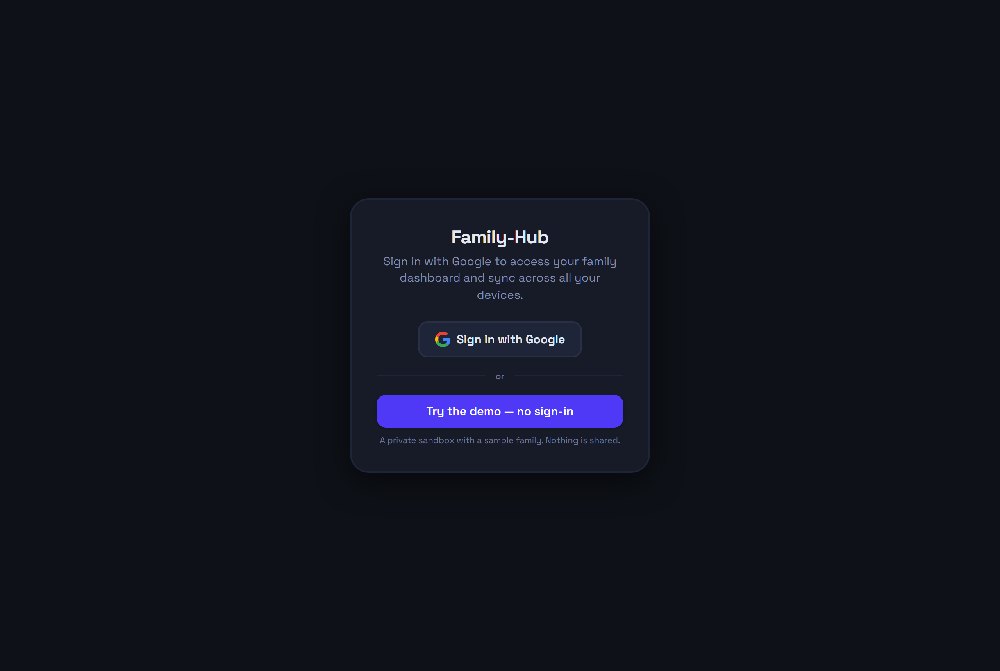

Three ways in, depending on how your Family-Hub is set up:

- **Sign in with Google** — the normal path on the cloud version. Your household's data is private to
  your family account (enforced by row-level security in the database, not just the UI).
- **Try the demo — no sign-in** — a private sandbox with a sample family (You, Ava, Max), seeded
  events, chores, and shopping lists. Nothing you do in the demo is shared or visible to anyone else.
- **Household passphrase** — on the home-appliance version (the LAN box), there are no accounts:
  one passphrase unlocks the household on your local network, and data never leaves the box.

## 2. The layout

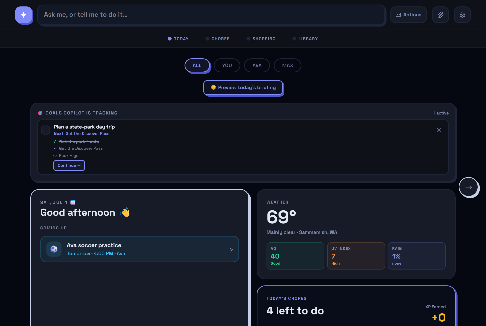

- **Top bar — the Copilot:** the *"Ask me, or tell me to do it…"* box is the single place to talk to
  the assistant. Next to it: **Actions** (email scans + booking handoffs), a **📎 attach** button
  (photos of flyers/schedules → events), and the **⚙ gear** (Manage settings).
- **Four pages**, switched with the tabs or the ← → arrows: **Today · Chores · Shopping · Library**.
- **Member filters** (All / You / Ava / Max) narrow Today's agenda to one person.

## 3. Today

Today is the home page: date, greeting, weather for your saved home location, today's agenda,
today's chores at a glance, and two special panels:

- **☀️ Preview today's briefing** — runs the morning agent on demand (next section).
- **🎯 Goals Copilot is tracking** — long-running plans the Copilot is carrying for you (e.g. *"Plan a
  state-park day trip"*), each with its steps checked off and a **Continue →** button to push the next
  step. Goals get created when you ask the Copilot to *"track this as a goal."*

## 4. The morning agent (your daily briefing)

Every morning (and on demand via the ☀️ button) the app doesn't just summarize — it **plans**:

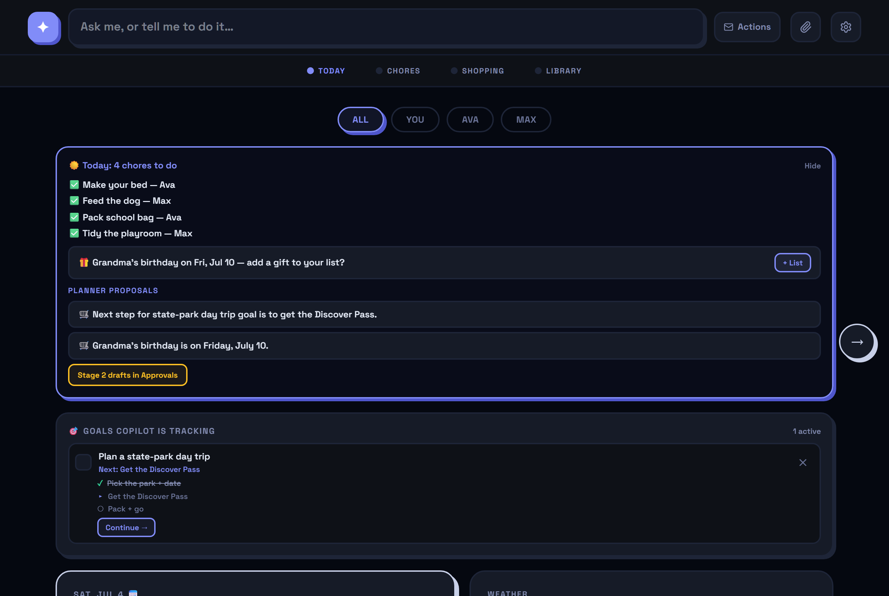

- The **briefing** lists today's chores, weather-aware reminders, and heads-ups it derives from your
  data (*"Grandma's birthday on Fri, Jul 10 — add a gift to your list?"*).
- **Planner proposals** are the agentic part: the model reads today's facts (calendar, weather, open
  goals, lists) and proposes up to **3 concrete next actions** — a shopping item, an event suggestion,
  or the next step of a goal it's tracking.
- Nothing happens on its own. Tap **Stage N drafts in Approvals** and each proposal becomes a
  pending draft **you** approve, modify, or dismiss. The model proposes; you decide.
- With email configured, the same briefing arrives as a **morning email** to the parents, and the
  drafts are already waiting in Approvals when you open the app.

## 5. Approvals — you are the approver

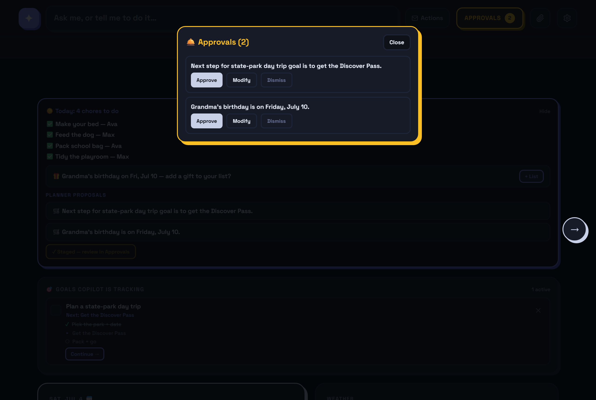

The **Approvals** bell appears in the top bar whenever something is waiting. Every risky or
proactive action lands here first — morning-agent proposals, deletes requested through the Copilot,
event suggestions. For each item: **Approve** (it happens), **Modify** (adjust it first), or
**Dismiss**. Reversible little things (like adding a shopping item you asked for directly) apply
immediately; anything destructive or self-initiated always queues here.

Two review surfaces, split by **who finishes the work**: **Approvals** holds what the *Copilot*
executes once you say yes; **Actions** (next to it) holds legwork handed to *you* — booking and
reservation handoffs you open and complete yourself. The demo household arrives with one suggestion
already waiting in Approvals, so you can try the approve flow immediately.

## 6. Chores — with XP, levels, and confetti

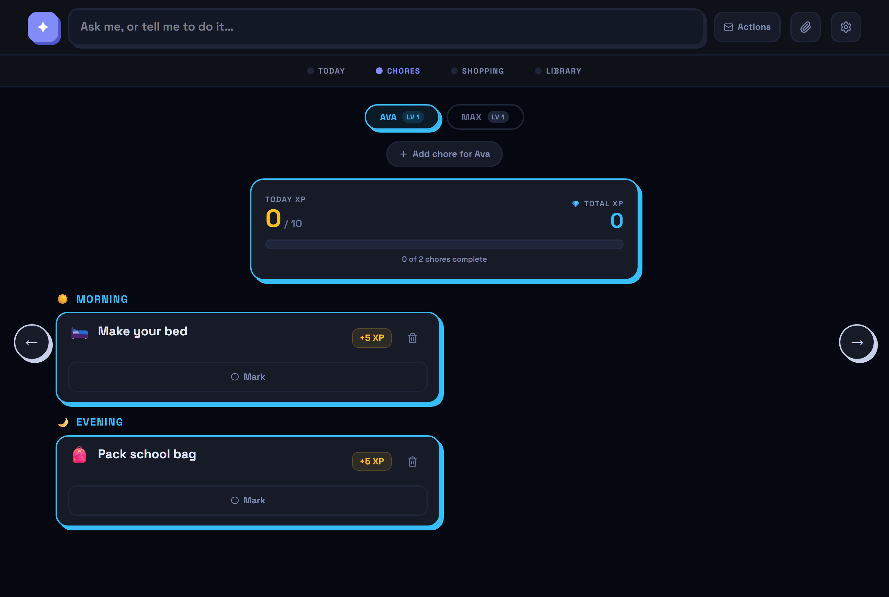

- One tab per kid with their **level**; chores grouped into **Morning / Evening**.
- Each chore has an auto-picked **emoji**, an **XP value**, and a big **Mark** button.
- Completing chores fills the day's XP bar and levels kids up over time.
- Parents add chores with **＋ Add chore**, or just tell the Copilot: *"add a chore for Max to water
  the plants tomorrow morning."* Deleting asks for confirmation.

### Kid mode — safe for a four-year-old

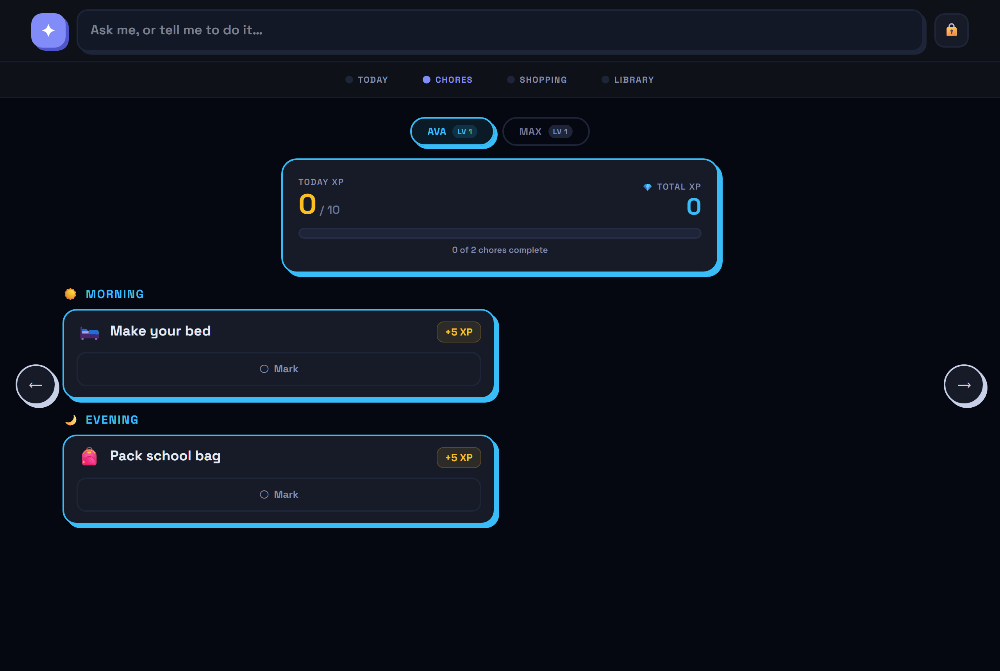
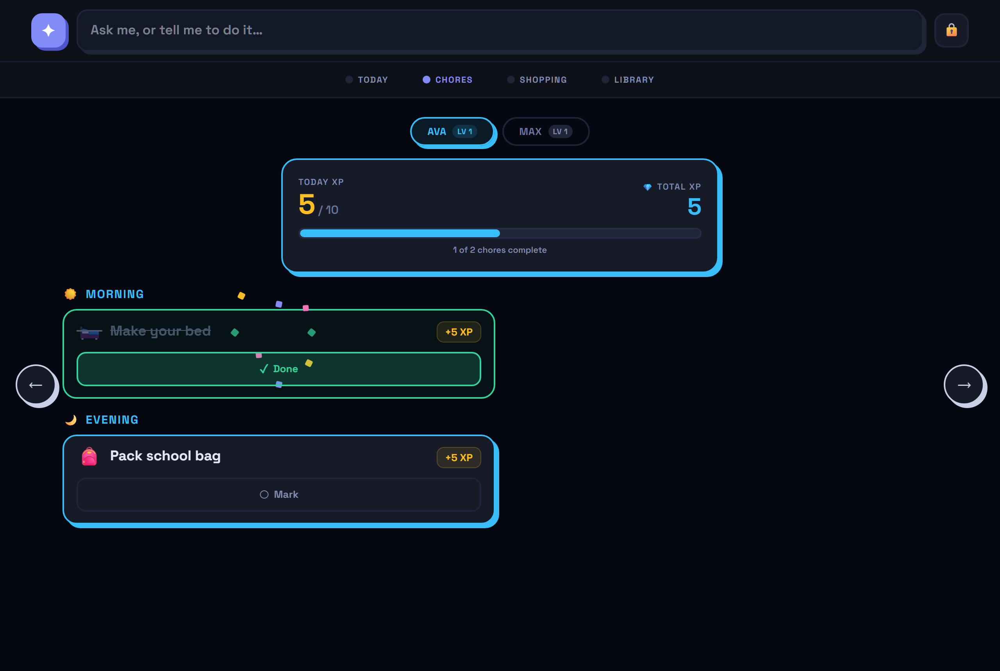

Turn on **Kid mode** in Manage (it's per-device — made for the kitchen wall tablet):

- Settings, Approvals, Actions, delete buttons, and add-forms **disappear**. There is nothing
  destructive left to tap.
- Completing a chore bursts **confetti** 🎉 and adds XP.
- The ask-box stays — kids can talk to the Copilot (they can even name it, see §10). The worst a
  kid's request can do is stage a draft for a parent to review; destructive actions require approval
  by design, not by trust.
- To exit, **hold the 🔒 lock for 3 seconds**, then enter the parent PIN if one is set.

## 7. Shopping — lists that know your stores

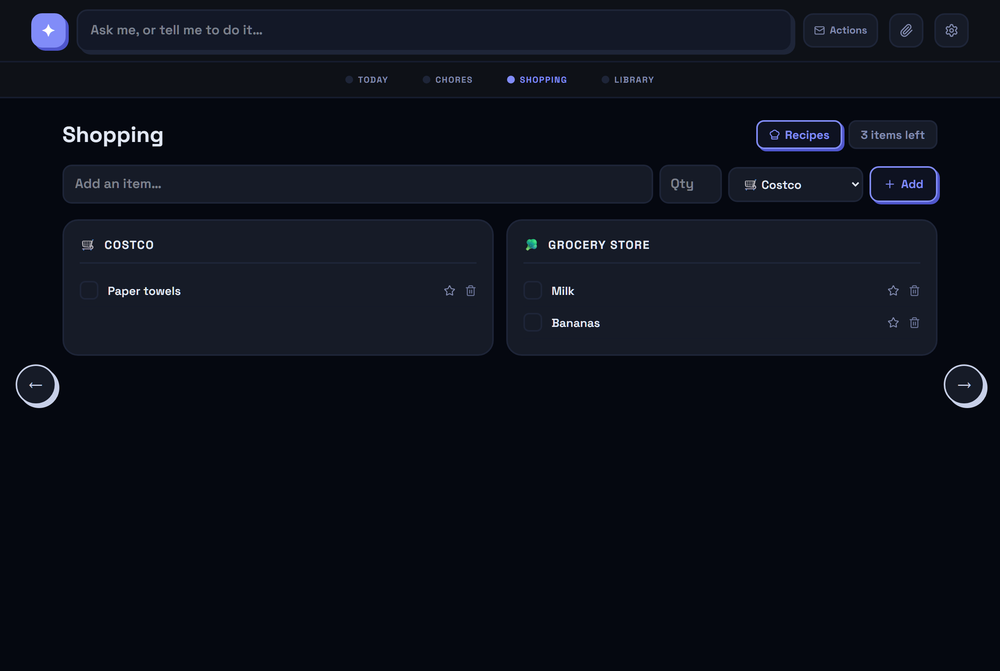

- Items live under **store lists** (Costco, the grocery store, the Indian store — whatever you use).
  Add by hand with quantity + store, star favorites, check items off as you shop.
- **Recipes** button: paste a recipe and it becomes a shopping list.
- Or skip the recipe entirely — tell the Copilot ***"I want to make paneer butter masala tomorrow"***
  and it derives the ingredients itself, in **buy units** ("Paneer (400 g pack)", "1 small bag"), skips
  the pantry basics, and sorts them into the right store lists.
- Each store list has its own **Clear** button (checked-off items go, starred staples stay), plus the
  global **Clear done**.

### Kroger cart — send a list to a real cart

Connect once in **Manage → Groceries**: hit **Connect Kroger account** and sign in on Kroger's page
(the app picks the sign-in up automatically — no popup gymnastics), pick the connection's store
(**"Shop at → Fred Meyer - Issaquah"**), then **link the lists** that shop there (say, *Grocery Store →
Kroger*, while *Costco* stays *Not linked*). The store belongs to the *connection*, not to any list —
several lists can point at it, and changing the store re-points them all at once. Then:

1. Every **linked** list gets its own **Send to <store>** button (there's also a one-tap offer right
   after a recipe/dish ask): your items are matched to real products at that store — a model must pick
   from the store's actual candidates or decline, and declines get one automatic second look.
2. The match is staged as **one Approval**, one line per item (*"Ginger (1 piece) → Organic Ginger Root
   (1 lb, $3.99)"*) — plus an honest reason for anything that didn't make it: *no match at this store*,
   *couldn't confidently match — try Send again*, or *search failed*. Unmatched items stay on your lists.
3. **Approve** it and the items land in your actual Kroger cart (quantities default to 1 — bump them
   there). You review and **pay in Kroger's own app** — Family-Hub never checks out and never holds
   payment details (the public Kroger API has no checkout endpoint at all).

Self-hosters: [docs/kroger-setup.md](kroger-setup.md) walks through the free developer app, the
redirect-URI gotcha, and `KROGER_CLIENT_ID` / `KROGER_CLIENT_SECRET`.

## 8. Library — the Copilot's memory

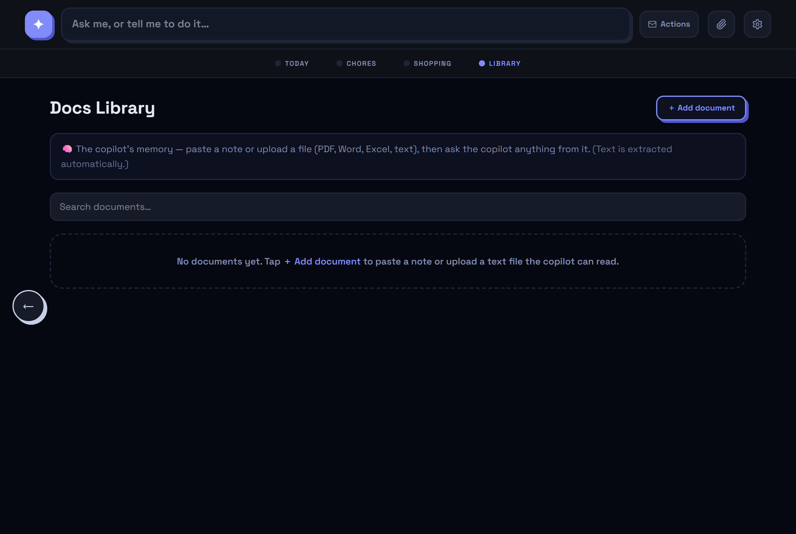

Paste a note or upload a file (PDF, Word, Excel, text) — school newsletters, camp packets, sports
schedules. Text is extracted automatically, and from then on you can ask the Copilot things like
*"what week is Ava's camp?"* and it answers **from your documents**.

## 9. The Copilot — ask it, or tell it to do it

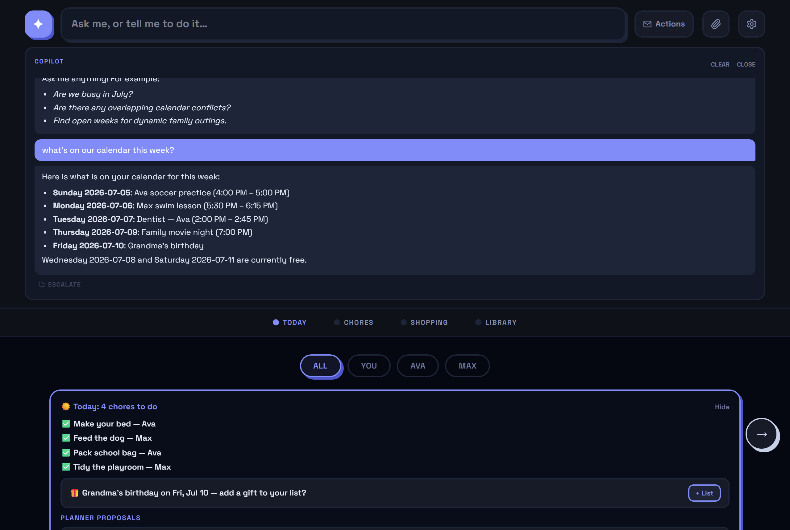

One box, two behaviors:

- **Questions** (*"what's on our calendar this week?"*, *"are we free Saturday?"*) get fast, grounded
  answers — the server feeds the model your real calendar, weather, and places data, so it can't
  invent events or venues.
- **Requests** (*"plan a Mount Rainier day trip next weekend and track it as a goal"*, *"move the
  dentist to 3pm"*, *"add milk"*) go to the full agent, which picks the right specialist (calendar,
  chores, shopping, outings, briefing, bills, documents), does the work — including live web research
  for outings — and saves the result. You'll see exactly what it did.

Things to know:

- **Booking handoffs:** when a plan involves booking something, the Copilot verifies the real
  booking page (only links it actually observed on the venue's own site), opens it in a new tab, and
  lists the details you'll need. **It never fills the form and never pays** — the final steps are yours.
  Pending handoffs live under **Actions**.
- **Money:** ask it to *"buy the tickets"* and it will decline — not as a policy performance, but
  because no payment capability exists anywhere in the system.
- **Attachments:** the 📎 button turns a photo of a flyer or schedule into event suggestions.
- **History & Modify:** past turns are kept per device; staged items can be modified before approval.
- **It stays in its lane:** ask it for homework help, code, or trivia and it politely declines and steers
  back to family plans — it's the household's copilot, not a general chatbot.

## 10. Email scans — bills, packages, kids' events

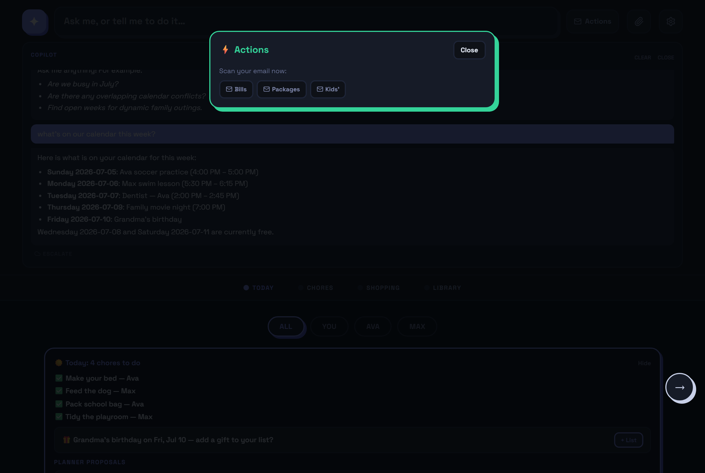

Connect Gmail (optional, parent-only) and the **Actions** panel can scan your inbox on demand — or
automatically every 30 minutes with the **Auto-scan** toggle in Manage:

- **Bills** → amount + due date are surfaced and tracked; ask *"what do we owe this month?"*
- **Packages** → delivery heads-ups as one-tap calendar adds.
- **Kids'** → school/activity emails become event suggestions you tap to accept.

Only the parsed fields (dates, amounts, titles) are kept — **email bodies are never stored**.

## 11. Manage — settings

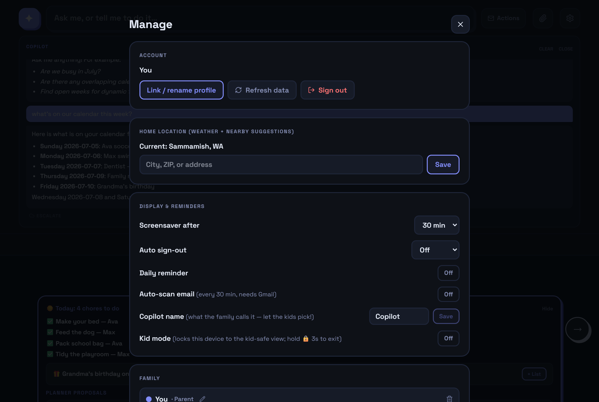

The ⚙ gear opens Manage:

- **Account** — link/rename your profile, refresh data, sign out.
- **Home location** — powers weather and nearby-place suggestions.
- **Display & reminders** — screensaver timer, auto sign-out, daily reminder.
- **Auto-scan email** — the 30-minute Gmail scan toggle (needs Gmail connected).
- **Copilot name** — what your family calls the assistant. Let the kids pick; it answers to its name.
- **Kid mode** — locks *this device* to the kid-safe view (hold 🔒 3s + PIN to exit).
- **Family** — add/rename members, mark parents vs kids.
- **Parent PIN (step-up)** — set a PIN that gates sensitive approvals and kid-mode exit.

## 12. Quick answers

| I want to… | Do this |
| --- | --- |
| Plan a weekend outing | Ask the Copilot: *"plan a zoo day Saturday"* — real venues, drive times, weather |
| Book a table at a restaurant | *"Dinner reservation at Din Tai Fung"* — it finds the real place near you and stages the handoff |
| Get help booking | Ask for the plan; open **Actions** → the handoff opens the real page + your details |
| Cook something | Tell the Copilot the dish — ingredients appear on the right store lists |
| Give a kid a new chore | *"Add a chore for Ava to feed the fish every morning"* or ＋ Add chore |
| Set up the wall tablet | Sign in once → Manage → **Kid mode: On** |
| Approve what the agent proposed | Tap the **Approvals** bell — Approve / Modify / Dismiss |
| Track a long-running plan | Add *"…and track it as a goal"* to any ask — watch the Goals strip |
| Make the app check email | Actions → Bills / Packages / Kids', or Manage → Auto-scan |

---

*More depth: [architecture](architecture.md) · [cloud deployment](cloud-run-deploy.md) ·
[LAN appliance install](INSTALL.md). Family-Hub is open source under AGPL-3.0.*
